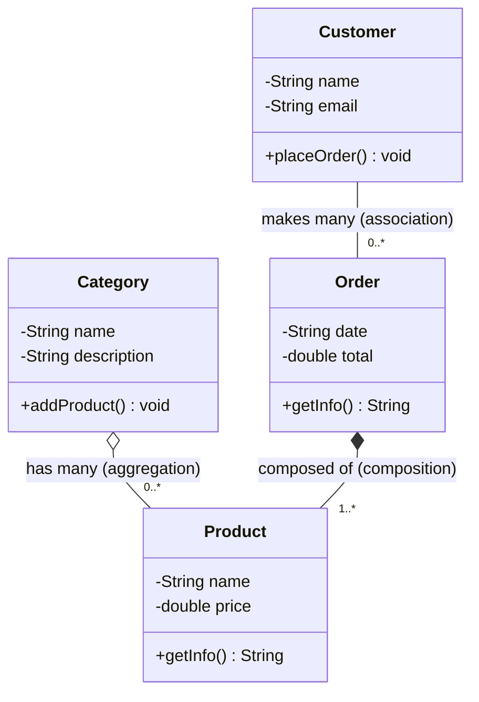

# Diagrama UML - Sistema de Tienda Online

```mermaid
classDiagram
    class Product {
        -String name
        -double price
        +getInfo() String
    }
    
    class Category {
        -String name
        -String description
        +addProduct() void
    }
    
    class Customer {
        -String name
        -String email
        +placeOrder() void
    }
    
    class Order {
        -String date
        -double total
        +getInfo() String
    }
    
    %% Relaciones
    Category o-- "0..*" Product : has many (aggregation)
    Customer -- "0..*" Order : makes many (association)
    Order *-- "1..*" Product : composed of (composition)
```